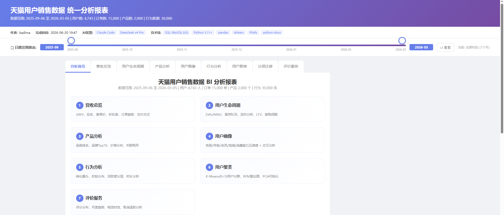
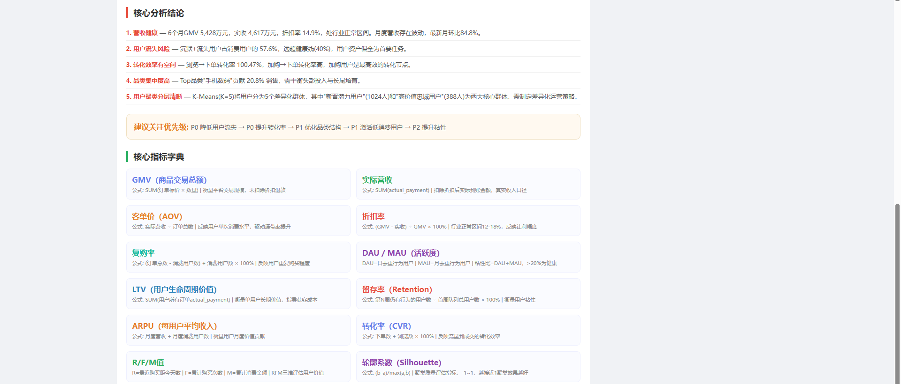

# 天猫用户销售数据分析平台

[](https://www.python.org/)
[](https://www.mysql.com/)
[](https://plotly.com/python/)
[](LICENSE)

kadima:

探索claude code + deepseek v4 pro 在数据分析+BI报表搭建方向的能力，学习合适的提示词。

---

完整的电商用户数据分析平台，覆盖**数据提取 → 特征工程 → 机器学习聚类 → 交互式可视化 → 文档报告生成**全流程。

> 项目由 AI 辅助开发（Claude Code + DeepSeek v4 Pro），从需求文档到可交付物全自动化。

**使用unified_report.html查看BI报表**




**在output_文件夹查看分析报告、PRD文档**

---

## AI 复现

项目包含 `project_prompt.txt`，这是一个完整的 **AI 编程提示词**。将该文件内容发送给支持代码生成的 AI（Claude Code / GPT-4 / DeepSeek），即可在任意环境中重建整个项目。

---

## 原始数据库表结构

| 表名 | 行数 | 说明 |
|------|------|------|
| `users` | 5,000 | 用户基础信息（性别/年龄/地域/会员等级） |
| `orders` | 15,000 | 订单交易数据（金额/折扣/支付方式/评价/物流） |
| `products` | 2,000 | 产品信息（品类/品牌/价格/销量） |
| `user_behaviors` | 30,000 | 用户行为日志（浏览/点击/收藏/加购） |
| `user_features` | 5,000 | 用户特征宽表（消费总额/频次/RFM 指标） |

---

## 输出文件说明

| 文件 | 格式 | 大小 | 内容 |
|------|------|------|------|
| `unified_report.html` | HTML | ~570 KB | 9 Tab 交互式 BI 综合报表，含日期滑块 + 桑基图 + 37+ 图表 |
| `tmall_exploration_report.docx` | Word | ~47 KB | 10 章节数据探索分析报告 |
| `tmall_prd.docx` | Word | ~44 KB | 产品需求文档 (PRD) |
| `tmall_summary.docx` | Word | ~45 KB | 项目总结报告 |
| `tmall_future_plan.docx` | Word | ~42 KB | 未来技术扩展规划 |

---

## 快速开始

### 1. 环境要求

- **Python**: 3.11 或更高版本
- **MySQL**: 8.0 或更高版本
- **操作系统**: Windows 

### 2. 安装依赖

```bash
pip install pymysql pandas numpy scikit-learn plotly python-docx
```

### 3. 准备数据库

1. 启动 MySQL 服务
2. 创建数据库 `tmall_data`：
   ```sql
   CREATE DATABASE IF NOT EXISTS tmall_data CHARACTER SET utf8mb4;
   ```
3. 导入数据到 5 张表（`users`, `orders`, `products`, `user_behaviors`, `user_features`）

### 4. 配置数据库密码

编辑 `user_auth_db.py`，将密码改为实际值：

```python
DB_CONFIG = {
    'host': 'localhost',
    'port': 3306,
    'user': 'root',
    'password': 'YOUR_PASSWORD_HERE',  # ← 改为实际 MySQL 密码
    'database': 'tmall_data',
    'charset': 'utf8mb4',
}
```

### 5. 运行项目

```bash
# 一键运行全部脚本
python main.py

# 或逐步确认模式
python main.py --step

# 仅检查环境和数据库连接
python main.py --check
```

也可单独运行各脚本：

```bash
python unified_report.py          # 生成统一 BI 报表
python generate_bi_report.py      # 生成 BI 可视化报表
python user_profiling.py          # 生成用户画像报告
python generate_exploration_report.py  # 生成数据探索报告
python generate_prd.py            # 生成 PRD 文档
python generate_summary.py        # 生成项目总结
python generate_future_plan.py    # 生成未来规划
```

---

## 功能特性

### 数据分析模块

| 模块 | 说明 |
|------|------|
| **营收总览** | GMV / 实收 / 客单价 / 折扣率 / 复购率，月度趋势 + 日度趋势 |
| **用户生命周期** | DAU / MAU / 粘性比 / 留存队列热力图 / LTV 分布 / 复购间隔 |
| **产品分析** | 品类 Top15 / 品牌 Top10 / 价格分布 / 关联购买 |
| **用户画像** | 性别 / 年龄 / 会员 / 地域 / 消费等级 五维画像 + 交叉分析 |
| **行为分析** | 浏览→下单转化漏斗 / 时段分布 / 活跃度分层 |
| **用户聚类** | K-Means (K=5) 聚类 / PCA 可视化 / RFM 雷达图 / 群体运营建议 |
| **分层迁移（桑基图）** | P1→P2 用户生命周期/RFM 价值迁移流 + 深度分析 + 运营方案 |
| **评价与服务** | 评分分布 / 月度趋势 / 物流时效 / 取消退款分析 |

### 技术亮点

- **交互式 BI 报表**: 9 个 Tab 页面的纯 CSS 切换，37+ 张 Plotly 交互式图表
- **日期滑块过滤**: 支持按月份区间动态过滤所有时序图表和 KPI 卡片
- **桑基图迁移分析**: 用户分层在 P1/P2 两时段间的迁移可视化
- **自动化文档生成**: 4 份 Word (.docx) 专业分析报告
- **隐私安全**: 数据库密码隔离到独立配置文件 `user_auth_db.py`

---

## 技术栈

| 层级 | 技术 |
|------|------|
| **数据存储** | MySQL 8.0 (5 张表, ~57,000 行数据) |
| **数据处理** | Python 3.11+ / pandas / numpy |
| **机器学习** | scikit-learn (K-Means 聚类 / StandardScaler / PCA) |
| **可视化** | Plotly 2.32+ (交互式图表 / 桑基图) |
| **文档生成** | python-docx (Word 报告) |
| **数据库连接** | pymysql |

---

## 项目结构

```
project/
├── main.py                          # 主入口，一键运行全部脚本
├── user_auth_db.py                  # 数据库连接配置（需修改密码）
│
├── unified_report.py                # 核心脚本: 9 Tab 统一 BI 报表
├── generate_bi_report.py            # 轻量级 BI 可视化报表
├── user_profiling.py                # 用户画像 + K-Means 聚类
├── generate_exploration_report.py   # 数据探索分析报告 (Word)
├── generate_prd.py                  # 产品需求文档 PRD (Word)
├── generate_summary.py              # 项目总结报告 (Word)
├── generate_future_plan.py          # 未来扩展规划 (Word)
│
├── project_prompt.txt               # AI 复现提示词（可用 LLM 重建整个项目）
├── README.md                        # 本文件
│
├── unified_report.html              # [输出] 统一 BI 报表 (567 KB)
├── tmall_exploration_report.docx    # [输出] 数据探索报告
├── tmall_prd.docx                   # [输出] PRD 产品需求文档
├── tmall_summary.docx               # [输出] 项目总结报告
└── tmall_future_plan.docx           # [输出] 未来扩展规划
```
---

## 作者

**kadima** | AI 辅助开发 (Claude Code + DeepSeek v4 Pro)

---

## License

MIT License
